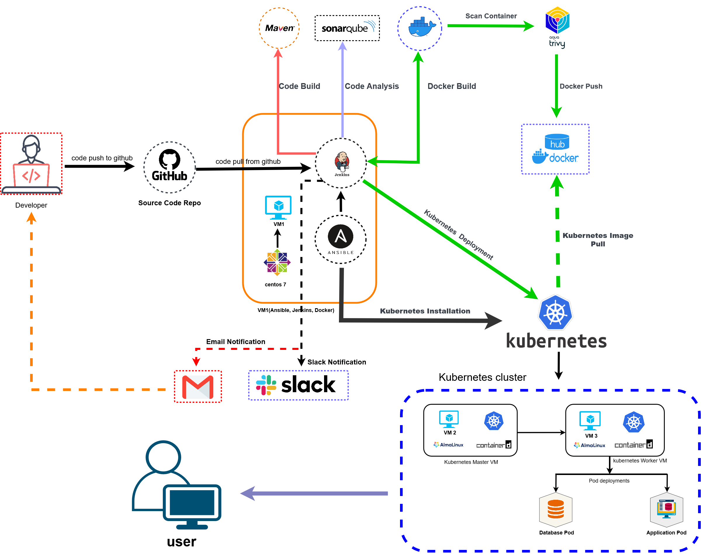
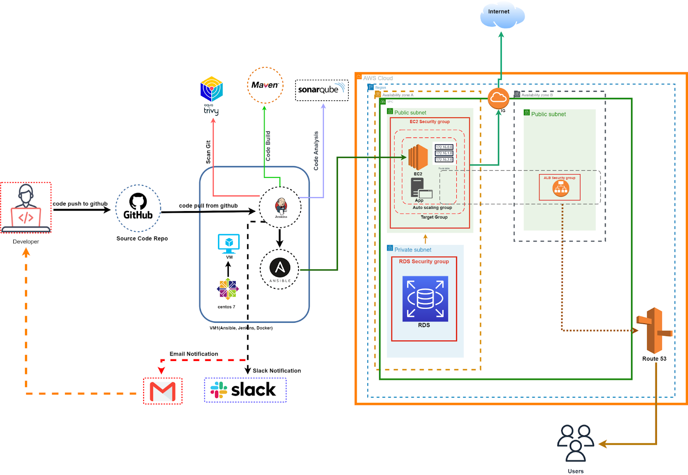

# ysd_B02_DevOps_Library_Management_System

Library Management System

Library Management System developed in Spring Boot, JPA, Hibernate, MySQL HTML, CSS, JavaScript.
What does it offer?

It allows user to manage Members, Categories, Books and Issueing Books.
Setup project
Setup database and run the project

    Project requires MySql database. Use Xampp
    Create a database and name it "sparklmsdb".
    Run the backend from SparkLmsApplication class.
    After running the backend just hit http://localhost:8080 to access the software.

Login

for login you may use username as 'admin' and password as 'admin'.

# On Premise Server Provision and Deployment using CI/CD Pipeline 

A complete CI/CD project with Jenkins pipeline to build and deploy a Github repository in kubernetes cluster.

## Project Description

Initially, configure a Kubernetes cluster with 1 master node, 1 worker node and a Jenkins server with Docker and Kubectl setup by Ansible playbook. Then automate build and publish of a Java application with MySQL database in Kubernetes cluster using CI/CD pipeline.

### Architecture diagram

## Project Setup

### Pre-requisites

Prepare three virtual machines in RHEL 9 equivalent environment. One of them is to be used for the Kubernetes master node, one is to be used for the Kubernetes worker node and the third is for the Jenkins server.

### Prepare Kubernetes cluster using Ansible

Follow this [kubernetes-cluster-setup-playbook](./ansible-playbook/kubernetes-installation) to setup Kubernetes cluster by running an Ansible playbook.

### Prepare Jenkins server

#### Install Jenkins, Docker, and Kubectl by Ansible

Follow this [jenkins-docker-setup-playbook](./ansible-playbook/docker-jenkins-installation) to install Jenkins server, Docker, Kubectl by running an Ansible playbook.

#### Plugins and tools setup from Jenkins dashboard

Install Plugins:

- Docker
- Docker Common
- Docker Pipeline
- Kubernetes
- Kubernetes Credentials
- Kubernetes CLI

Tools setup:

- JDK - Name: `Java_11`, JAVA_HOME: `/usr/lib/jvm/java-11-openjdk`
- Git - Name: `Git`, Path executable: `/usr/bin/git`
- Maven - Name: `Maven_3`, MAVEN_HOME: `/usr/share/maven`
- Docker - Name: `Docker_24`, Installation root: `/usr/bin/`

#### Credentials setup from Jenkins dashboard

- Kind: 'Username with password', ID: `docker_credentials`, Username: `<username>`, Password: `<docker_access_token>`.
- Kind: 'Secret file', ID: `kubeconfig`, File: select your kubeconfig.txt file.

#### Configure new pipeline from Jenkins dashboard

- Create New Item > Enter name (kubernetes-deploy) > Select ‘Pipeline’ type.
- Goto ‘Your pipeline’ > Configure > Select Poll SCM > Set schedule `H/2 * * * *` > Select Pipeline script from SCM > Repository URL > Select your branch to build > Script Path (Jenkinsfile) > Save.
- Goto ‘Your pipeline’ > Build Now.

## Deploy new update with CI/CD pipeline

Creating new commit in the repository will trigger a new build with following stages:

- Git Clone
- Build Artifact
- Build Container Image
- Publish Docker Image
- Remove Image from Local
- Deploy App in Kubernetes

## Browse the application from a browser

- Visit <http://worker-node-address> from your local browser.
- Use username 'admin' and password 'admin' to login to the dashboard.

# AWS Server Provision and Deployment using CI/CD Pipeline

A complete CI/CD project with Jenkins pipeline to build and deploy a GitLab repository in AWS cloud.

## Project Description

Prepare EC2 Launch template to run with Auto-scaling. Configure a Route 53 domain and TLS certificate with a Load balancer for the application. Prepare RDS database for the VPC network. Configure a Jenkins CI/CD pipeline to build and run a Java application in an EC2 instance.

### Architecture Diagram

## Project Setup

### Pre-requisites

Prepare one virtual machines in RHEL 9 equivalent environment.

### Setup AWS services

- Create VPC, subnets, and route tables
- Create EC2 instance launch template
- Create SSL/TLS Certificate for Load balancer
- Create Auto scaling group and Load balancer
- Create RDS database
- Create Route 53 domain

### Setup Gitlab repository

- Create Gitlab repository
- Configure SSH key with developer and Gitlab.

### Prepare Jenkins server

#### Install Jenkins by Ansible

Follow this [jenkins-docker-setup-playbook](./ansible-playbook/docker-jenkins-installation) to setup Jenkins server by running Ansible playbook. Please note that we only need [jenkins-setup](https://github.com/mohammadrony/jenkins-docker-setup-playbook/tree/main/jenkins-setup) role for this application.

#### Configure Jenkins server tools and credentials

Tools setup:

- JDK - Name: `Java_11`, JAVA_HOME: `/usr/lib/jvm/java-11-openjdk`
- Git - Name: `Git`, Path executable: `/usr/bin/git`
- Maven - Name: `Maven_3`, MAVEN_HOME: `/usr/share/maven`

Credentials setup:

- Kind: 'SSH Username with private key', ID: `aws_ssh_key`, Username: `<username>`, Private key: Enter directly `<ssh-private-key>`.
- Kind: 'SSH Username with private key', ID: `gitlab_ssh_key`, Username: `<username>`, Private key: Enter directly `<ssh-private-key>`.

#### Configure new pipeline from dashboard

- Create New Item > Enter name (aws-deploy) > Select 'Pipeline' type.
- Goto 'Your pipeline' > Configure > Select Poll SCM > Set schedule `H/2 * * * *` > Select Pipeline script from SCM > Repository URL > Select your branch to build > Script Path (Jenkinsfile) > Save.
- Goto 'Your pipeline' > Build Now.

### Update application.properties for database host

Update RDS database host name in [application.properties](src/main/resources/application.properties) file.

## Deploy new update with CI/CD pipeline

Creating new commit in the repository will trigger a new build with following stages:

- Git Clone
- Build Artifact
- Push app to EC2
- [Run app using java service](./ansible-playbook/java-project-deploy-to-ec2)
- Update Running App

## Browse the application from a browser

- Visit https://your-domain.com from your local browser.
- Use username 'admin' and password 'admin' to login to the dashboard.

Thank you.

